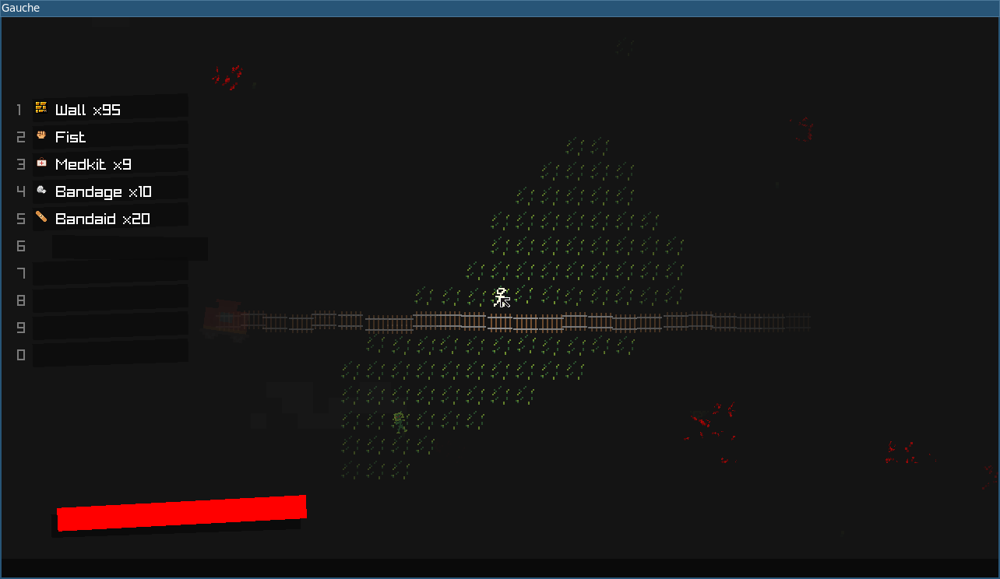

# Gauche (Rust prototype)

This is the legacy Rust + raylib prototype. Active C++ development is in [Gauche](https://github.com/wegfawefgawefg/gauche).

The prototype explores close-range survival, item use, tile destruction, and a small simulated world.

Original development ran from June 17, 2025 through June 28, 2025.

## Screenshot

